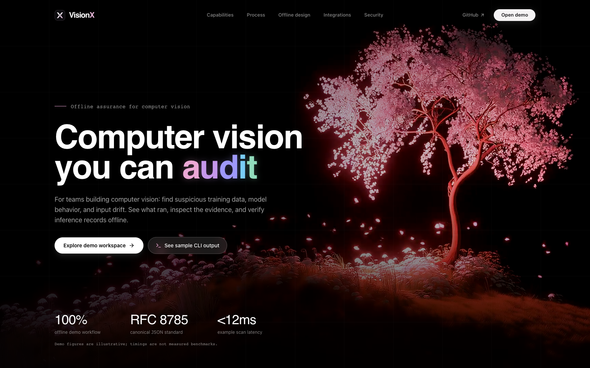
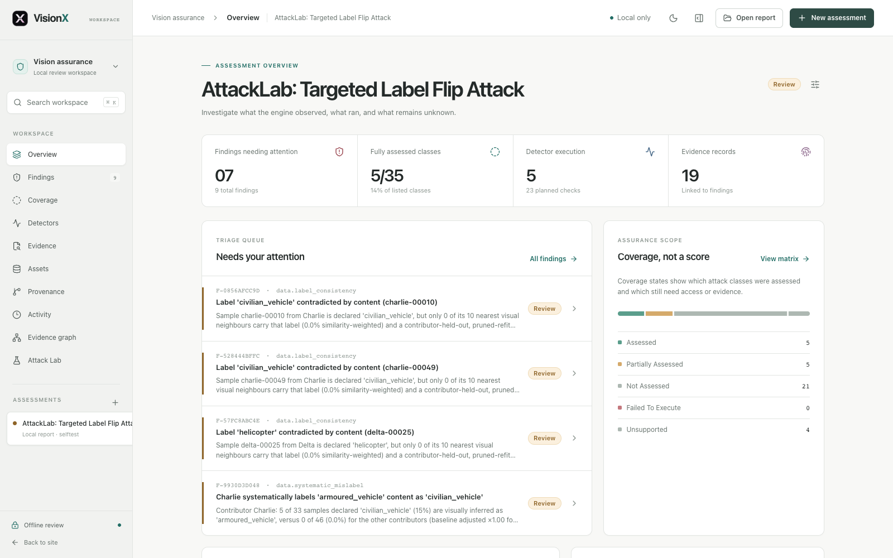
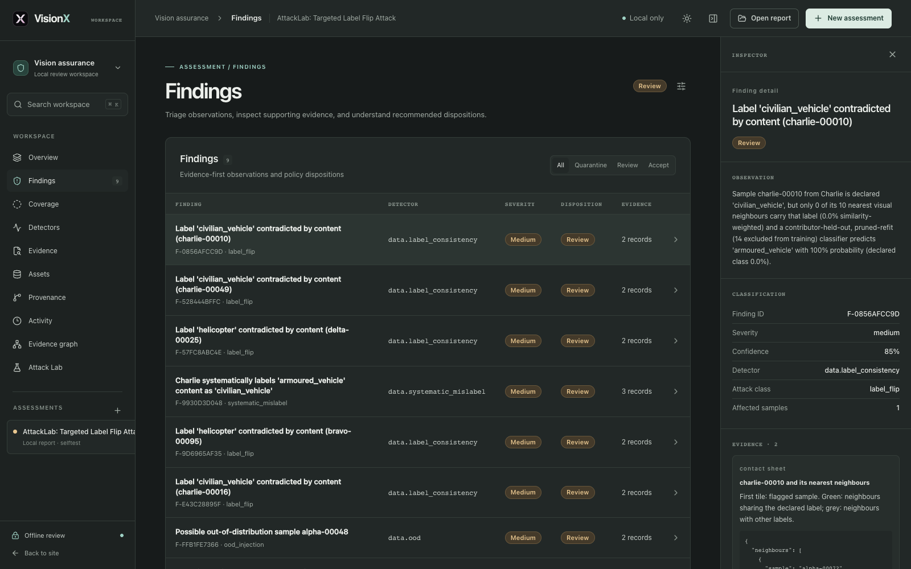
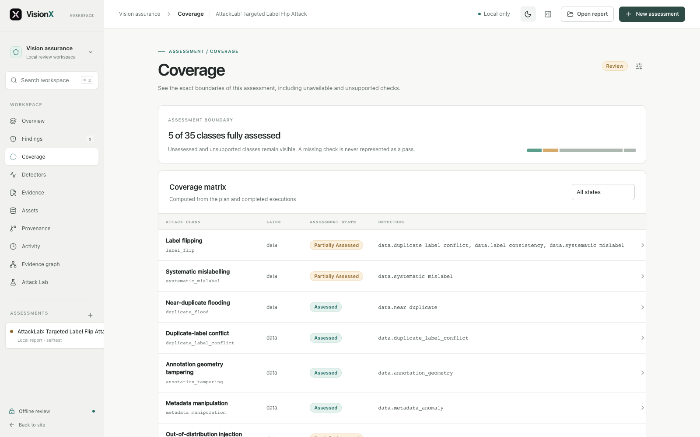
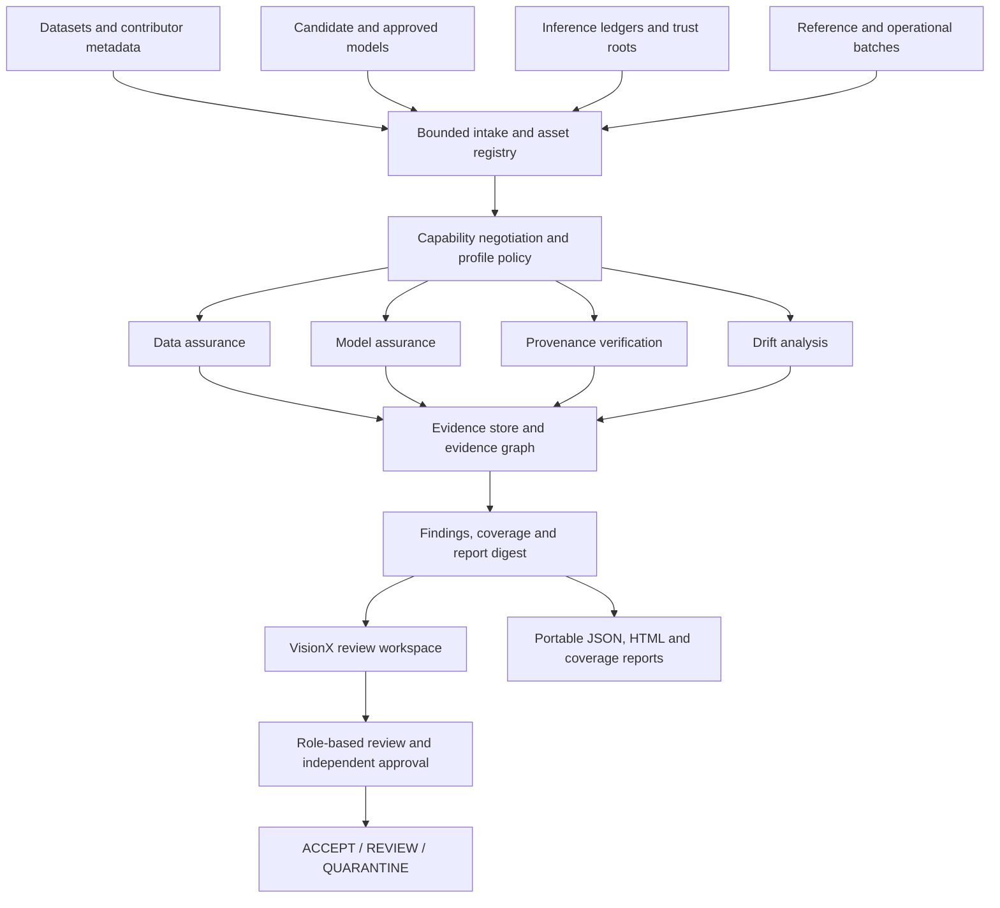

<div align="center">


# VisionX

### Computer vision you can audit.

**Offline integrity assurance for data, models, and inference records.**

[](https://github.com/raghav-shell/VisionX/actions/workflows/quality.yml)
[](LICENSE)
[](pyproject.toml)
[](frontend/package.json)

**Smart India Hackathon 2026 · Problem Statement SIH26228**<br>
Trustworthy Computer Vision Integrity Assurance for Data, Models and Inference Outputs in Multi-Contributor Pipelines

[Product tour](#product-tour) · [Quick start](#quick-start) · [Judge walkthrough](#six-minute-judge-walkthrough) · [Evaluation](#evaluation-and-reproducibility) · [Team](#contributors)

</div>



*Actual frontend capture. Landing-page demo figures are illustrative; measured scenario results are documented in [Evaluation](#evaluation-and-reproducibility).*

## The problem

A computer-vision system can perform well in a test set while relying on mislabeled training data, a substituted model, or altered inference records. In a pipeline with multiple contributors, each hand-off introduces another trust boundary. Restricted environments add a practical constraint: sensitive assets may need to stay entirely offline.

Reviewers need more than an alert. They need to know **what changed, which evidence supports the finding, what could not be checked, and who approved the decision**.

## Our solution

VisionX brings dataset analysis, model integrity checks, inference provenance, and drift assessment into one local review workflow. An analyst imports assets, selects an assurance profile, inspects the evidence, and records a governed decision: **ACCEPT**, **REVIEW**, or **QUARANTINE**.

The platform assesses supplied assets; it does not train or serve production models. Its underlying Python package and primary CLI are named **VisionSentinel**; `visionx` is also available as a CLI alias.

| Assurance layer | What VisionX examines | What the reviewer receives |
| :--- | :--- | :--- |
| **Data integrity** | Duplicates, inconsistent labels, annotation geometry, metadata, outliers, and trigger-like patterns | Linked findings, affected samples, contributor analysis, and supporting evidence |
| **Model integrity** | Candidate-versus-approved identity, architecture, weights, and behavior; access-dependent backdoor indicators | Digest comparisons, probe results, detector prerequisites, and limitations |
| **Inference provenance** | Signed records, record order, input/model bindings, and external anchors | Ed25519 signature checks, hash-chain verification, and Merkle checkpoint evidence |
| **Operational drift** | Changes in image statistics and semantic distributions | KS, PSI, and Wasserstein statistics with bounded interpretation |
| **Human governance** | Disposition requests, reviewer roles, and sensitive changes | Independent approval where required and a signed audit trail |

### What makes the approach distinctive

- **Coverage is part of the result.** Missing inputs, restricted access, and execution failures remain visible alongside successful checks.
- **Capabilities are negotiated before execution.** Each detector declares its requirements; the engine probes the supplied assets and persists a plan.
- **Findings remain connected to evidence.** Content-addressed evidence, detector outcomes, and report digests make an assessment inspectable.
- **Human decisions remain accountable.** Sensitive changes use approval separation instead of allowing one person to both request and approve them.
- **The workflow is designed for local operation.** Assets, analysis, evidence, and reports can remain on the operator's workstation after dependencies are provisioned.

Potential applications include supplier model acceptance, multi-team dataset review, restricted research environments, and inspection of operational CV batches. These are intended use cases, not claims of deployed customer systems.

## Product tour

These screenshots show the actual frontend reviewing a report generated from the shipped **Targeted Label Flip Attack** scenario with the `selftest` profile. The report was opened locally through **Open report**; the screenshots do not imply a live authenticated backend session. See [capture notes](docs/images/screenshots/README.md) for provenance.

### 1. Understand the assessment at a glance

The overview brings findings, detector execution, evidence counts, and coverage gaps into one triage view.



### 2. Inspect the reason behind a finding

The findings view connects each observation to its detector, severity, disposition, and evidence. The inspector exposes the reasoning and affected sample rather than leaving the reviewer with a bare score.



### 3. See the exact assessment boundary

The coverage matrix distinguishes a completed assessment from partial, unavailable, failed, and unsupported checks.



<details>
<summary><strong>How to interpret the five coverage states</strong></summary>

| State | Meaning |
| :--- | :--- |
| `ASSESSED` | A suitable detector completed with the required evidence. |
| `PARTIALLY_ASSESSED` | A detector ran with documented restrictions. |
| `NOT_ASSESSED` | Relevant checks exist, but required inputs or access were unavailable. |
| `FAILED_TO_EXECUTE` | A planned check encountered an execution error. |
| `UNSUPPORTED` | The platform explicitly makes no coverage claim for this attack class. |

An assessed class is not a guarantee that every possible attack in that class will be detected. Coverage describes the checks performed and their prerequisites.

</details>

## Architecture



The browser uses the FastAPI backend for authenticated operations and can also open a report locally. Background jobs execute assessments, while the workspace exposes activity and results. Evidence, reports, keys, and SQLite state live under `var/` by default; `VISIONSENTINEL_HOME` selects another workspace root.

| Component | Technologies |
| :--- | :--- |
| Review interface | Next.js 16, React 19, TypeScript, Tailwind CSS, Lucide |
| API and contracts | Python 3.12+, FastAPI, Pydantic, Uvicorn |
| Scientific analysis | NumPy, SciPy, scikit-learn, Pillow |
| Model tooling | ONNX, ONNX Runtime; optional PyTorch for supported analyses and lab scenarios |
| Evidence and provenance | SHA-256, Ed25519, canonical JSON, hash chains, Merkle checkpoints |
| Persistence and migrations | SQLAlchemy, SQLite, Alembic |
| Verification | pytest, Playwright, GitHub Actions |

Dataset loaders support VisionSentinel manifests, COCO, YOLO, Pascal VOC, ImageFolder, and plain image directories. Model checks depend on format, available access, and the selected profile; see the [detector methodology](docs/detector-methodology.md).

## Quick start

### Prerequisites

Use **Python 3.12**, **Node.js 22**, npm, and Git for the setup below. The package supports Python 3.12+; Linux is recommended for the strongest available worker isolation. Prepare dependencies on a connected machine before moving to an offline environment.

### 1. Install the backend and frontend

```bash
git clone https://github.com/raghav-shell/VisionX.git
cd VisionX

python3.12 -m venv .venv
source .venv/bin/activate
python -m pip install --upgrade pip
python -m pip install -e ".[dev,torch]"

npm --prefix frontend ci
```

On Windows, activate the environment with `.venv\Scripts\Activate.ps1` in PowerShell. The `torch` extra enables model-based Attack Lab scenarios; a lighter dataset-focused installation can use `".[dev]"`.

### 2. Start the local API

From the repository root, with the virtual environment active:

```bash
visionsentinel users create analyst01 --role analyst --display-name "Lead Analyst"
visionsentinel users create approver01 --role approver --display-name "Assurance Officer"

VISIONSENTINEL_INSECURE_COOKIES=1 \
VISIONSENTINEL_ALLOWED_ORIGINS=http://127.0.0.1:3001 \
python -m uvicorn visionsentinel.api.app:create_app --factory --host 127.0.0.1 --port 8000
```

Passwords are entered interactively. The cookie override is for this loopback HTTP setup; use secure cookies with HTTPS outside local development. In PowerShell, set these variables through `$env:VARIABLE_NAME` before running the server.

### 3. Start the frontend in a second terminal

```bash
npm --prefix frontend run dev -- --hostname 127.0.0.1 -p 3001
```

Open **[127.0.0.1:3001](http://127.0.0.1:3001)** for the landing page or **[127.0.0.1:3001/workspace](http://127.0.0.1:3001/workspace)** for the workspace. The Next.js server proxies `/api/*` to `http://127.0.0.1:8000`. Set `VISIONX_API_ORIGIN` when using a different backend address.

This application-factory launch requires authentication for workspace data and enables the **Sign in to server** flow. The alternative `visionsentinel server` command currently enables anonymous read-only access, so the authenticated walkthrough uses the factory launch above. Keep a separate approver account for governance decisions.

For a production frontend build, stop the development frontend and run:

```bash
npm --prefix frontend run build
npm --prefix frontend run start -- --hostname 127.0.0.1 -p 3001
```

If Turbopack encounters a local process/port restriction, `npm --prefix frontend run build -- --webpack` is an alternative production build command.

> **Packaging status:** the current Next.js configuration uses a running Next.js server and API rewrites. The Docker recipe still expects `frontend/out`, a static export this configuration does not produce. Use the two-process setup above; the container/offline packaging recipe needs alignment before relying on it for deployment.

## Six-minute judge walkthrough

Start both services and provision accounts before presenting. Use the checked-in synthetic scenarios so the demonstration does not depend on private datasets.

| Time | Action | What it demonstrates |
| :--- | :--- | :--- |
| **0:00–0:45** | Introduce a pipeline receiving data and models from multiple contributors. | The trust problem and why local assurance matters. |
| **0:45–1:45** | Authenticate as an analyst, open **Attack Lab**, and run **Targeted Label Flip Attack**. Open its linked scan when complete. | A reproducible adversarial scenario and actual engine execution. |
| **1:45–3:00** | Open **Findings** and inspect a label-consistency observation. | Traceability from an alert to the sample, detector, and evidence. |
| **3:00–4:00** | Open **Coverage** and **Detectors**. Explain a partially assessed or unavailable check. | Explicit assessment boundaries and access-aware execution. |
| **4:00–5:15** | Request a disposition change with a justification; use the independent approver account to review it. | Separation of duties and an auditable human decision. |
| **5:15–6:00** | Show the report artifacts and the published benchmark, including misses. | Portable evidence and a reproducible evaluation record. |

Scenario execution time depends on the machine. Prepare a completed scan before the presentation as a fallback. For a browser-independent demonstration:

```bash
visionsentinel attacklab validate
visionsentinel attacklab run label_flip_targeted --profile selftest
```

See the [extended demo guide](docs/SIH_DEMO.md) for the review sequence and shutdown guidance.

## CLI and portable reports

```bash
# Assess supplied assets using a declared policy.
visionsentinel scan \
  --dataset /path/to/dataset \
  --model /path/to/candidate.onnx \
  --profile strict \
  --out ./reports

# Independently verify a signed inference ledger.
visionsentinel verify /path/to/ledger.jsonl \
  --trust-root /path/to/trust-root.json

# Inspect available profiles, detectors, and local offline checks.
visionsentinel profiles list
visionsentinel detectors
visionsentinel selftest --airgap
```

Each scan report bundle contains:

| Artifact | Purpose |
| :--- | :--- |
| `report.json` | Structured assessment for tools and the workspace's **Open report** action |
| `report.html` | Human-readable report that can be reviewed offline |
| `coverage.md` | Assessment states, gaps, and required additional evidence |
| `manifest.json` | File digests and result binding; an Ed25519 signature when a signing key is supplied |

CLI report signing is explicit: use `scan --sign-with /path/to/report-key.pem` with a provisioned report-role key. Opening a report in the browser does not verify its cryptographic signatures. See [report format](docs/report-format.md) and [provenance specification](docs/provenance-spec.md).

## Evaluation and reproducibility

The checked-in [benchmark report](benchmarks/latest.md) and [machine-readable results](benchmarks/latest.json) provide the current evidence. They contain **10 controlled scenarios: 9 positive controls and 1 clean control**, with **1 scenario excluded by its fitness gate**.

| Observation | Checked-in result |
| :--- | :--- |
| Expected signal detected in eligible positive controls | **6 of 8 scenarios** — scenario-level TPR of **0.75** |
| Positive scenarios with expected-signal misses | `duplicate_flood`, `semantic_shift` |
| Scenario excluded by fitness validation | `systematic_mislabel` |
| Clean-control material alerts | **2 alerts / 400 samples = 0.005 alerts per clean sample** |
| AUROC | **Not estimated**; compatible labeled continuous scores were unavailable |

Successful positive controls cover targeted label flipping, localized patch poisoning, model substitution, weight perturbation, ledger tampering, and illumination drift. These are results on the shipped controlled scenarios, not a general accuracy claim for arbitrary datasets or attacks. The clean-control measurement is **not a conventional sample-level false-positive rate**.

Reproduce the evaluation and relevant checks from the repository root:

```bash
make profiles
make detectors
visionsentinel attacklab validate
make test
make benchmark

# Requires a built frontend and Playwright Chromium.
npm --prefix frontend run build
(cd frontend && npx playwright install chromium)
make e2e
```

`make benchmark` regenerates the benchmark artifacts and can return a nonzero status when scenario acceptance checks fail. This preserves misses and invalid runs instead of hiding them. The [evaluation protocol](docs/evaluation.md) defines eligibility, denominators, and unavailable metrics; the [quality workflow](.github/workflows/quality.yml) defines backend, scientific, frontend, and browser checks.

## Security boundaries and current limitations

VisionX includes bounded uploads, registered asset IDs for web scans, format-specific loader limits, role checks, CSRF protection, content-addressed evidence, and constrained model workers where supported. The offline self-test checks cryptographic primitives and external-origin references; it does not certify a host or network as secure.

- Findings are risk indicators. They do not prove malicious intent or the absence of compromise.
- Model and backdoor checks depend on available references, model access, and calibration. Statistical drift alone does not establish an attack.
- External anchors are required to detect validly signed ledger-tail truncation.
- The host OS, physical acquisition process, and arbitrary third-party model code remain outside the assurance guarantee.
- SQLite supports the local workstation design; multi-node operation requires additional deployment and database engineering.

See the [threat model](docs/threat-model.md) and [known limitations](docs/known-limitations.md) for the full boundary.

## Roadmap

The next engineering priorities are:

- [ ] Align container packaging with the current frontend runtime and verify a complete offline installation.
- [ ] Resolve the duplicate-flood and semantic-shift misses; repair the systematic-mislabel fitness gate.
- [ ] Expand clean and benign-shift controls across detector families, with held-out calibration and matching confidence intervals.
- [ ] Establish compatible sample labels and continuous score vectors before reporting sample-level FPR or AUROC.
- [ ] Validate larger workloads and document resource envelopes, backup, and multi-user deployment procedures.

## Repository and documentation

```text
frontend/              Landing page and assurance review workspace
src/visionsentinel/
  api/                 Sessions, asset APIs, jobs, and backend routes
  attacklab/           Controlled scenario generation and execution
  contracts/           Typed assessment and API contracts
  data_assurance/      Dataset and contributor analysis
  model_assurance/     Model identity, behavior, and backdoor indicators
  drift/               Distribution analysis and interpretation
  engine/              Capability negotiation and scan orchestration
  evidence/            Content-addressed evidence and graph construction
  provenance/          Signatures, chains, checkpoints, and verification
  governance/          Roles, decisions, and approval workflows
  loaders/             Bounded dataset and model input handling
  reporting/           Report bundles and scan comparison
profiles/              Assurance policies and execution budgets
scenarios/             Reproducible Attack Lab manifests
benchmarks/            Generated evaluation artifacts
schemas/               Exported contract schemas
tests/                 Unit, integration, security, scientific, regression, and E2E
```

| Read next | Purpose |
| :--- | :--- |
| [Architecture decisions](ARCHITECTURE_DECISIONS.md) | Design rationale, boundaries, and trade-offs |
| [Operator guide](docs/operator-guide.md) | Asset review, governance, and incident handling |
| [Detector methodology](docs/detector-methodology.md) | Evidence requirements and analytical assumptions |
| [Provenance specification](docs/provenance-spec.md) | Trust roots, signed records, and verification |
| [Evaluation protocol](docs/evaluation.md) | Metric definitions and scientific claim boundaries |
| [Air-gap operations](docs/airgap.md) | Offline operating considerations |

## Contributing and license

Contributions are welcome through [issues](https://github.com/raghav-shell/VisionX/issues) and pull requests. For a detector change, include its prerequisites, evidence contract, coverage behavior, and a reproducible scenario or relevant test. Run the checks appropriate to the change and document remaining limitations.

VisionX is licensed under the **Apache License 2.0**. See [LICENSE](LICENSE).

## Contributors

| Contributor | Contributions |
| :--- | :--- |
| **[Raghav Sharma](https://github.com/raghav-shell)** | Frontend architecture and VisionX branding; responsive landing page, visual assets, and interaction design; assurance workspace, light/dark themes, dataset and model inspection views, drift and provenance interfaces; frontend API proxy integration. |
| **[Kartikeya Yadav](https://github.com/kartikeyajay2006)** | Core assurance architecture and typed contracts; safe dataset/model loading, data and model detectors, drift analysis, cryptographic provenance, evidence graph, and report bundles; governance and persistence; REST API, Attack Lab, CLI, evaluation, and scientific/integration tests. |
| **[Ankit Pandey](https://github.com/ankit25bcs10610)** | Live frontend/backend integration and API contract alignment; persistent background jobs, scan lifecycle recovery, and graceful shutdown; API security and governance hardening; model/ledger Attack Lab scenarios, manifest validation, benchmark provenance, and CI/browser workflow reliability. |

*Contributions reflect the repository's Git history. Areas overlap across the team; this table describes recorded work rather than exclusive ownership.*
