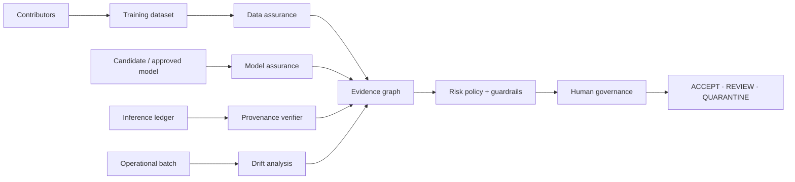
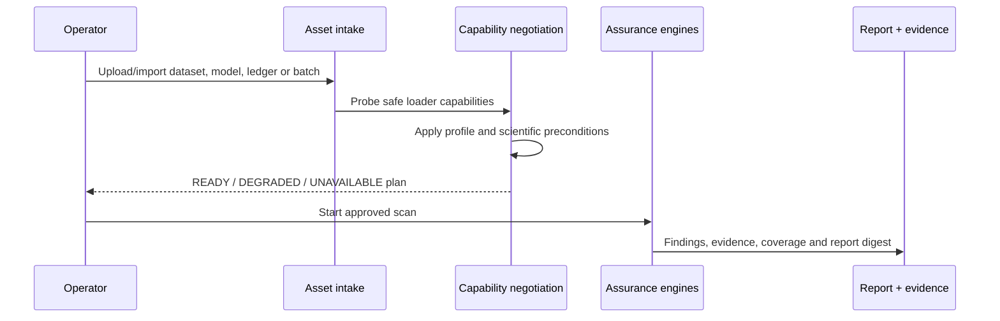

# VisionSentinel

> **Air-Gapped Computer Vision Integrity & Assurance Platform**<br>
> Smart India Hackathon 2026 · SIH26228 — Trustworthy Computer Vision Integrity Assurance for Data, Models and Inference Outputs in Multi-Contributor Pipelines

<p align="center">
  
</p>

VisionSentinel is an offline workstation for answering a difficult but practical question: **what evidence supports trust in this computer-vision pipeline?** It assesses supplied datasets, models, inference records and operational batches; it does not train or serve a production model.

It never produces a fake global “secure” score. Every scan declares what was assessed, partially assessed, unavailable, failed during execution, or unsupported—and connects findings to evidence, access assumptions and known limitations.

## Why it matters

Modern CV pipelines receive data from multiple contributors, models from suppliers and prediction records from several runtime environments. A compromise can occur before deployment, at model hand-off, or after inference. VisionSentinel makes those trust boundaries inspectable:



## Five assurance layers

| Layer | Question | Evidence produced |
|---|---|---|
| Data integrity | Can we trust the supplied training data? | duplicate clusters, label-consistency signals, geometry/metadata anomalies, OOD and trigger-like correlation evidence, contributor risk |
| Model integrity | Is this the approved model and how does it behave? | artifact and architecture digest comparison, weight statistics, deterministic probes, activation/trigger assessments where access permits |
| Inference provenance | Was an inference record altered or replayed? | Ed25519 signatures, hash-chain verification, Merkle checkpoints, anchor checks |
| Operational drift | Has the incoming distribution changed? | interpretable image axes, KS/PSI/Wasserstein statistics, semantic comparison and review-capped interpretation |
| Governance | Who made a decision, and was it independently approved? | role-based decisions, two-person rule for sensitive changes, signed audit ledger |

## Honest coverage model

The platform reports coverage per attack class, not a single percentage pretending to prove security.

| State | Meaning |
|---|---|
| `ASSESSED` | A suitable detector completed with the required evidence. |
| `PARTIALLY_ASSESSED` | A detector ran with a documented restriction. |
| `NOT_ASSESSED` | A relevant detector exists but inputs or access were unavailable. |
| `FAILED_TO_EXECUTE` | A planned check encountered an execution error. This is never relabelled as unavailable. |
| `UNSUPPORTED` | This product intentionally does not claim coverage for that attack class. |

## Capability negotiation before execution

Every detector declares its requirements. VisionSentinel probes the actual supplied assets, applies profile restrictions and persists the plan before running analysis.



## Security and air-gap boundaries

- Browser requests use same-origin authentication, CSRF protection and role checks.
- Web scans, drift analysis and provenance verification use registered asset IDs—not server filesystem paths.
- Uploads are size bounded; archives, images, XML, JSON and models have dedicated loader limits.
- Untrusted model execution is isolated in a constrained worker where supported.
- Evidence is content addressed and re-hashed on read.
- Runtime application code does not require external network access, cloud services, CDNs or model downloads.
- The built-in self-test performs a static external-origin audit and verifies core cryptographic primitives.

<p align="center">
  
</p>

## Quick start

Requirements: Python **3.12+**, Node.js **20+**, and Linux is recommended for the strongest sandbox controls.

```bash
make install
make test

# Validate profiles and inspect detector declarations
make profiles
make detectors

# Build the static, same-origin dashboard
npm --prefix frontend install
npm --prefix frontend run build
```

Run the local API/dashboard in development mode:

```bash
# Provision local accounts without exposing passwords in shell history.
visionsentinel users create analyst01 --role analyst --display-name "Lead Analyst"
visionsentinel users create approver01 --role approver --display-name "Assurance Officer"

# Serve the API and static dashboard on the same origin.
visionsentinel server --demo
```

Open `http://127.0.0.1:8000/` and sign in. The dashboard supports bounded asset upload, scan planning, controlled Attack Lab scenarios, findings, coverage, contributors, drift, provenance and evidence-graph inspection.

## CLI workflow

```bash
# Assess a dataset and model
visionsentinel scan \
  --dataset /path/to/dataset \
  --model /path/to/candidate.onnx \
  --profile strict

# Verify an exported signed ledger independently
visionsentinel verify /path/to/ledger.jsonl --trust-root /path/to/trust-root.json

# Exercise the offline controls and check for external dependencies
visionsentinel selftest --airgap
```

Scan reports include `report.json`, `report.html`, `coverage.md` and `manifest.json`. Reports are designed to work offline and bind their underlying result document through a cryptographic digest.

## What is implemented

- Safe loaders for supported image datasets and model formats; capability probing and profile validation.
- Dataset assurance: duplicates, label/geometry/metadata integrity, OOD, trigger-like evidence and contributor analysis.
- Model assurance: identity, architecture, weights, behaviour, activation-aware and access-aware backdoor assessments.
- Drift: covariate and semantic evidence with operational-versus-suspicious reasoning limits.
- Provenance: canonical signed records, chained entries, Merkle checkpoints, anchors and a minimal verifier.
- Governance: roles, disposition requests, sensitive-change approval separation and audit events.
- Attack Lab: reproducible shipped scenarios, evaluation plumbing and security/scientific/regression tests.

## What VisionSentinel does *not* claim

- It does not certify a system “secure”.
- It does not prove a generic model is free of backdoors, adversarial vulnerability, extraction or membership-inference risk.
- Trigger reconstruction and activation methods are only meaningful when their prerequisites and calibration conditions are met.
- Statistical drift alone is not proof of malicious manipulation.
- It does not secure the host OS, physical acquisition pipeline or arbitrary third-party model code.

These limits are deliberate. They are surfaced in detector metadata, coverage and reports rather than hidden behind a dashboard score.

## Project structure

```text
src/visionsentinel/
  api/                 FastAPI, sessions, CSRF, asset boundary and static dashboard service
  attacklab/           Reproducible attack scenarios and corpus generation
  contracts/           Strict Pydantic contracts and JSON schema exports
  data_assurance/      Dataset integrity and contributor-risk detectors
  drift/               Covariate, semantic and interpretation analysis
  engine/              Scan planning, execution and result assembly
  evidence/            Content-addressed evidence and graph construction
  governance/          Roles, approvals and audit workflow
  loaders/             Safe datasets, archives, images and model backends
  model_assurance/     Identity, behavioural and backdoor-related assessments
  provenance/          Canonicalisation, signatures, chains, Merkle and verification
  reporting/           Offline reports, coverage and comparison
frontend/              Static Next.js dashboard
profiles/              Validated assurance profiles
scenarios/             Shipped controlled Attack Lab scenarios
schemas/               Exported contracts
tests/                 Unit, integration, security, scientific and regression suites
```

## Documentation and technical decisions

- [Architecture decisions](ARCHITECTURE_DECISIONS.md) — boundaries, contracts, design corrections and explicit non-goals.
- `schemas/` — machine-readable contract schemas.
- `profiles/` — reproducible scan policy and budget settings.
- `scenarios/` — reproducible controlled attack inputs used by the Attack Lab.

## Current readiness: a candid assessment

The engine architecture, provenance model, test suite and coverage honesty are strong hackathon foundations. To be finalist-ready, the project still needs a polished reproducible demo bundle, measured benchmark results on held-out scenario families, end-to-end browser tests, operator documentation and a rehearsed six-minute story that shows evidence before claims.

## Licence

Apache-2.0. See [LICENSE](LICENSE).

## Contributors

- [Ankit Pandey](https://github.com/ankit25bcs10610) — engineering and CI reliability
