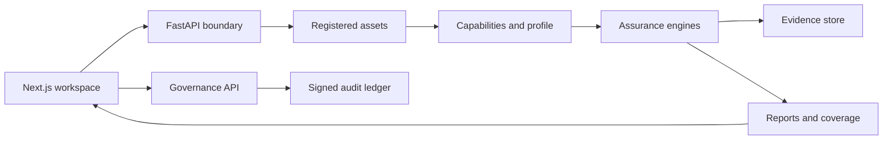

# 04 · Architecture and trust boundaries

[Handbook home](../README.md) · [Project README](../../README.md)

VisionX separates asset intake, assurance execution, evidence storage, and human governance. The browser is a review client. Scientific checks and cryptographic verification run in the backend or Python tooling.

## Responsibilities

| Boundary | Implementation | Contract |
| --- | --- | --- |
| Browser to API | Sessions, roles, origin checks, CSRF, body limits | Mutations require an authenticated identity; input assets are IDs. |
| Asset intake | Copy/import, bounded format parsing, digests | A registered path is resolved by the server. |
| Planning to execution | Capability probing, detector registry, budget and preconditions | The plan is distinct from the actual execution result. |
| Execution to evidence | Proposed findings, evidence blobs, final policy | Findings must keep their assumptions and limitations. |
| Evidence to reporting | Result digest and artifact manifest | Hashes bind content; signatures need a trusted public key. |
| Human review | Governance service and audit ledger | Relaxations require an independent decision. |

Background scan and Attack Lab jobs persist status. Startup recovery reconciles interrupted work, and shutdown coordinates active jobs. This is not a distributed worker system or a guarantee that every interrupted operation will resume automatically.

## State and custody

SQLite stores operational records such as users, jobs, assets, and decisions. Content-addressed evidence, report bundles, and signed ledgers serve different integrity purposes. The database is not immutable merely because some events are also signed.

The workspace root defaults to `var/`. Keep assets, database state, evidence, reports, ledgers, and keys together for a coherent backup. Independently retained public trust material and anchors allow checks outside the original workstation.

## Runtime topology

The current frontend runs as Next.js with API rewrites to FastAPI. The API can serve an existing static dashboard directory, but the current Next.js configuration does not create `frontend/out`. The Docker recipe's static-export assumption is a documented packaging gap.

Some model formats are handled by restricted workers; containment varies by platform and runtime. Python-level network guards do not replace an operating-system network boundary. See [sandbox and offline controls](09-security-governance.md#sandbox-and-offline-controls).

For the detailed rationale and non-goals, read [architecture decisions](../../ARCHITECTURE_DECISIONS.md). Source entry points are [the API factory](../../src/visionsentinel/api/app.py), [scan engine](../../src/visionsentinel/engine/scan.py), and [job runner](../../src/visionsentinel/api/runner.py).

---

[03 · Previous](03-workspace.md) · [05 · Next](05-data-and-models.md)
